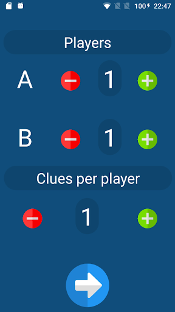
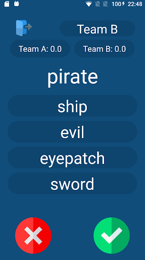
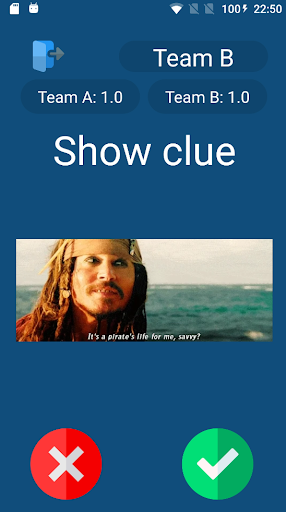

# Activities
Simple game for Fridays' meetings with friends.

## Preview
      

## Rules
Group players into two teams and set number of clues per person. In the first round each player describe verbally clue without using words from the forbidden list. Subsequently (in the following round), GIF is displayed and one needs to explain it without saying anything. When in trouble player can use  lifebelt which costs 1 point. Better and faster wins. Good luck!

## Credits
Icons: https://www.flaticon.com/authors/freepik  

## Author
- **Wojciech Wrzesień** - [wwrzesien](https://github.com/wwrzesien)

